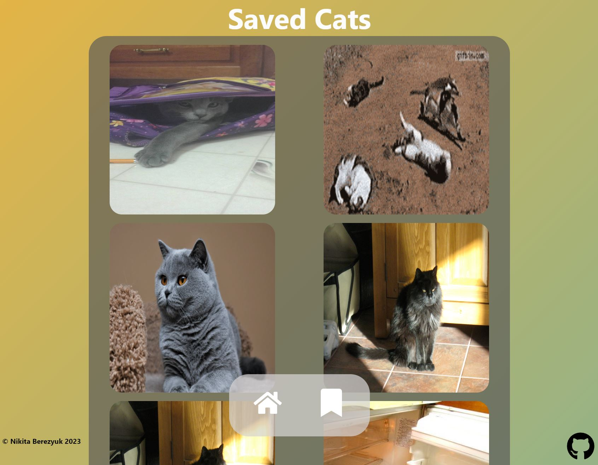

# Cat Watch

## Demo
Link: https://cat-watch-front-end.onrender.com/

## Setup
Prerequistes: 
- Install Node.js
- Install NPM

Clone repo to local
> $ git clone https://github.com/berezucc/Cat-Watch

Run Front-end
> $ cd client

> $ npm start

Start Back-end Server
> $ cd server

> $ node server.js

## Build
Front-end developed with React.js framework.\n
Back-end developed using Node.js and Express.\n
Database used for this project is MongoDB.\n
The Cat API used for cat images.

## About
I wanted to better familiarize myself with full-stack and MERN stack development.
Using my prior knowledge of front-end web development, I used the most current framework, React.js.
I also have prior experince with SQL and MySQL but I decided that utilizing MongoDB and their services will make this project run smoother.
The front-end and back-end are hosted on onrender.com

## Visuals

## References
https://thecatapi.com/
https://www.mongodb.com/languages/mern-stack-tutorial
